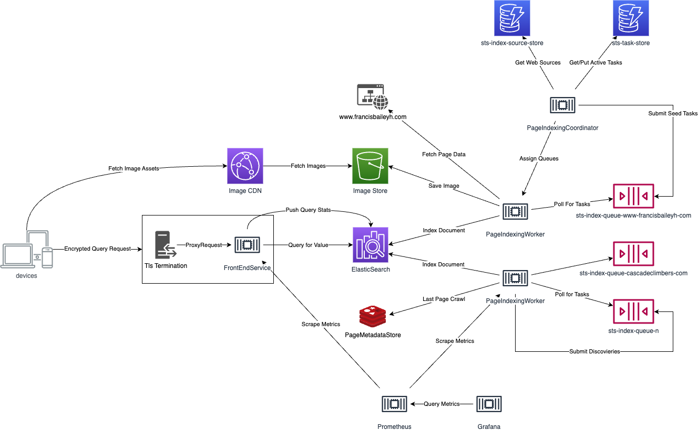

# Search the Summits
Search the summits is a custom built search engine designed to search blogs, forums and other sites for trip reports, alpine journals and other documents related to ascending the world's mountains. 

The search engine is comprised of several services to facilitate searching content including a custom web crawler system and frontend for serving up and running search queries. The crawling system supports a number of key features including:
- automated content refreshing
- distributed rate limiting
- web page, pdf and image processing
- recursive/organic link discovery
- per-site page filtering

In theory, the system can be adapted to other domains, however there are several customizations that are specific to searching mountains. Namely:
1. Summits are usually 2-3 words e.g. "Ember Mountain" and the queries are tailored around this
2. Content is strictly controlled via a curated list of websites. As a result the crawler system will not process links from outside the origin host it's currently working on.
3. Web Pages are heavily filtered to avoid "useless" pages like blog previews, home pages etc. This prevents a list of articles with a summit name from appearing in search results alongside the actual blog page.

## Architecture
Overall architecture is as follows:


How each IndexingWorker handles tasks:


## Running the System Locally
You'll need to define the following values. As of writing,

### Resource Creation
Save the following values to a `variables.env` file in the project repository.
```
AWS_ACCESS_KEY_ID=<Account with SQS Access>
AWS_SECRET_ACCESS_KEY=<Account with SQS Access>
ES_ENDPOINT=<Elastic Search Endpoint>
ES_FINGERPRINT=<Elastic Search Fingerprint>
ES_PASSWORD=<Elastic Search Password>
ES_USERNAME=<Elastic Search Username>
REDIS_ENDPOINT=redis
REDIS_PASSWORD=redispw
REDIS_PORT=6379
REDIS_USERNAME=default
ENVIRONMENT_TYPE=DEV
S3_REGION=us-east-1
S3_ENDPOINT=<S3 Endpoint>
S3_ACCESS_KEY=<S3 Access Key>
S3_SECRET_KEY=<S3 Secret Key>
S3_STORE_NAME=<S3 Bucket Name>
COORDINATOR_ACCESS_ID=<Coordinator User Name>
COORDINATOR_ACCESS_KEY=<Coordinator Access Key>
WORKER_ENDPOINTS=http://page-indexing-worker:8080
```
Right now, the IAM users are created manually, but this could be improved with some infrastructure as code in the future. The environment variables are explained as follows:

### AWS_ACCESS_KEY + AWS_ACCESS_SECRET
The IAM user that the PageIndexingWorker will use. It needs the following permission:
```
{
    "Version": "2012-10-17",
    "Statement": [
        {
            "Sid": "VisualEditor0",
            "Effect": "Allow",
            "Action": [
                "sqs:DeleteMessage",
                "sqs:GetQueueUrl",
                "sqs:ListDeadLetterSourceQueues",
                "sqs:ChangeMessageVisibility",
                "sqs:ReceiveMessage",
                "sqs:SendMessage",
                "sqs:GetQueueAttributes"
            ],
            "Resource": [
                "arn:aws:sqs:*:259609947632:sts-index-queue-*"
            ]
        },
        {
            "Sid": "VisualEditor1",
            "Effect": "Allow",
            "Action": "sqs:ListQueues",
            "Resource": "*"
        }
    ]
}
```
Ideally this should be renamed, but for now it works.

#### ES_* Values
When you setup ElasticSearch for the first time, it will supply you with a fingerprint and username/password. You can copy those values into their respective env variables. You can run:
```
docker-compose --profile backend build
docker-compose --profile backend up
```
Look for the ElasticSearch output.

#### REDIS_* Values
Use the default values as supplied in docker-compose.yml. No need to change any values from those listed above, unless you want to customize things.

#### ENVIRONMENT_TYPE
This defines what resources will be accessed and where. E.g. resources are created with a `test-` prefix when the env type is `DEV`. Keep this as `DEV` unless deploying to a prod environment.

#### S3_* Values
Search the summits uses Digital Ocean's "Spaces" which is an S3 compatible API. It does not require permissions policies like in AWS, but rather just an Access Key and Access ID. If using AWS, ensure the IAM user has permission to put/read/delete objects.

### COORDINATOR_ACCESS_KEY + COORDINATOR_ACCESS_SECRET
The coordinator IAM user needs the following permissions:
```
{
    "Version": "2012-10-17",
    "Statement": [
        {
            "Sid": "VisualEditor0",
            "Effect": "Allow",
            "Action": "dynamodb:ListTables",
            "Resource": "*"
        },
        {
            "Sid": "VisualEditor1",
            "Effect": "Allow",
            "Action": [
                "dynamodb:BatchGetItem",
                "sqs:GetQueueUrl",
                "sqs:ChangeMessageVisibility",
                "dynamodb:BatchWriteItem",
                "dynamodb:PutItem",
                "dynamodb:DeleteItem",
                "sqs:SendMessage",
                "dynamodb:Scan",
                "sqs:GetQueueAttributes",
                "dynamodb:Query",
                "dynamodb:UpdateItem",
                "dynamodb:CreateTable",
                "dynamodb:DescribeTable",
                "sqs:DeleteQueue",
                "dynamodb:GetItem",
                "sqs:CreateQueue",
                "dynamodb:UpdateTable",
                "sqs:SetQueueAttributes"
            ],
            "Resource": [
                "arn:aws:sqs:*:259609947632:sts-index-queue-*",
                "arn:aws:dynamodb:*:259609947632:table/sts-*"
            ]
        },
        {
            "Sid": "VisualEditor2",
            "Effect": "Allow",
            "Action": [
                "dynamodb:Scan",
                "dynamodb:Query"
            ],
            "Resource": "arn:aws:dynamodb:*:259609947632:table/sts-*/index/*"
        }
    ]
}
```

### Running
```
./gradlew build

docker-compose --profile frontend build
docker-compose --profile frontend up -d

docker-compose --profile backend build
docker-compose --profile backend up -d
```

*Occasionally the page-indexing-worker starts before the ElasticSearch cluster is up and running. Simply restart the indexing-worker container once ES is online.*

At start up there will be no content, but you can access the frontend at `localhost:8080`. To index content so that there's something to search, you'll need to navigate to the `sts-index-source-store` dynamodb table in AWS. Add an entry like so:
```
{
  "host": {
    "S": "www.francisbaileyh.com"
  },
  "documentTtl": {
    "N": "7776000"
  },
  "nextUpdate": {
    "N": "0"
  },
  "queueUrl": {
    "S": ""
  },
  "refreshIntervalSeconds": {
    "N": "864000"
  },
  "seeds": {
    "SS": [
      "https://www.francisbaileyh.com"
    ]
  }
}
```

Wait a few minutes for the coordinator to assign the task to the worker and you should see the index start to get populated.
