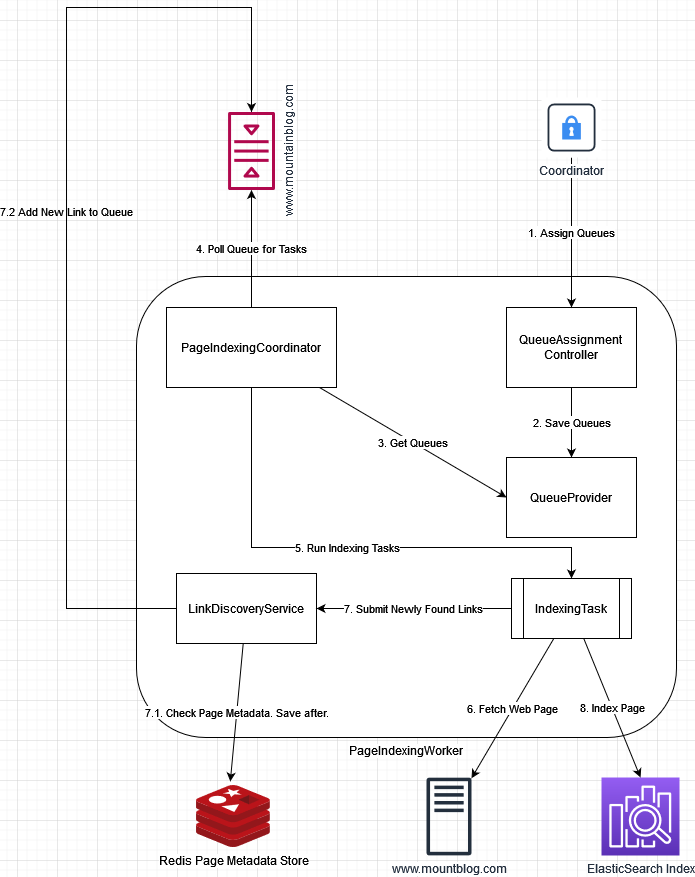

# Search the Summits
A custom search engine for all things mountaineering. A custom built distributed web crawler pulls from a curated list of web page sources and indexes their content for searching.

## Testing

// TODO - Add Data Import/Export

From the main project directory run:
```
docker-compose build
docker-compose --profile frontend up
```
You can now query the Search API with:
```
curl localhost:8080/api/summits?query=mount+adams
```


#### Architecture
Overall architecture is as follows:


How each IndexingWorker handles tasks:
